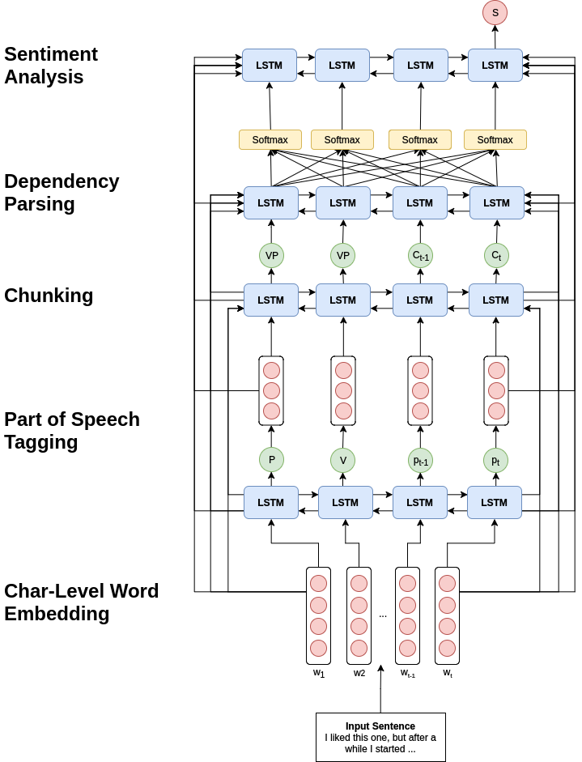

# Deep Multi-Task Sentiment Analysis

## Why Multi-Task?

Recently years have shown amazing results in supervised learning due the advent of Deep Neural Networks and Gradient Descent Implementations, however, most of them were limited to one-task learning. Where the model would specialized at only objective during training.

Because most of real-world problems are composed from various sub-tasks, it would make sense to make sense this distinction on the model itself.

However, methods of effectivelly training a single model at various tasks at once aren't very consolidated yet. Making this an active area of research and the main motivation of the paper that inspired this post.

The paper *A Joint Many-Task Model: Growing a Neural Network for Multiple NLP Tasks* is a groundbreaking proposal for unification and joint training of many common Natural Language Processing tasks into a single Deep Learning model.

## Architecture

